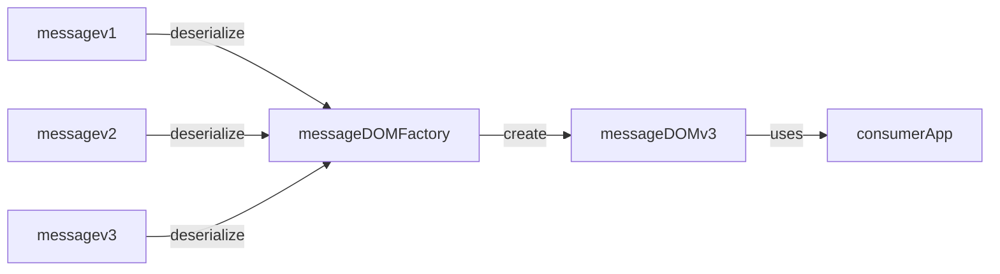
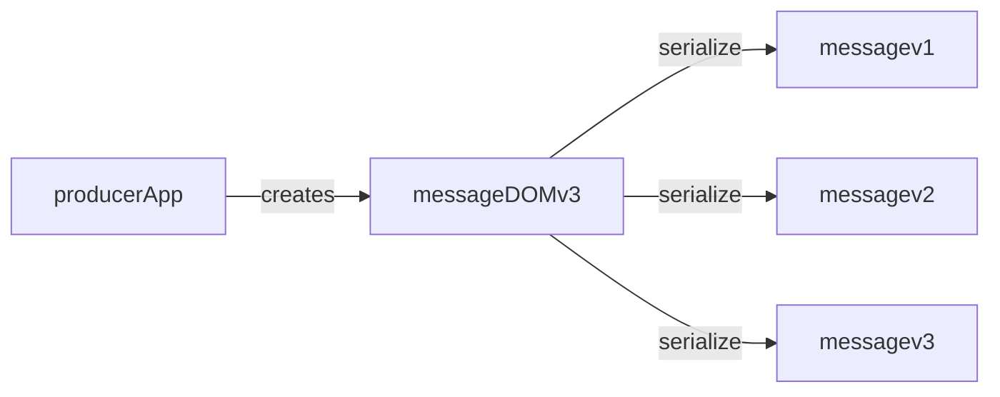
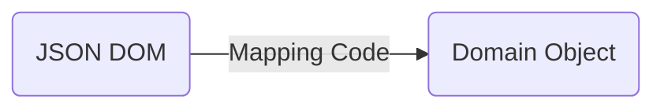
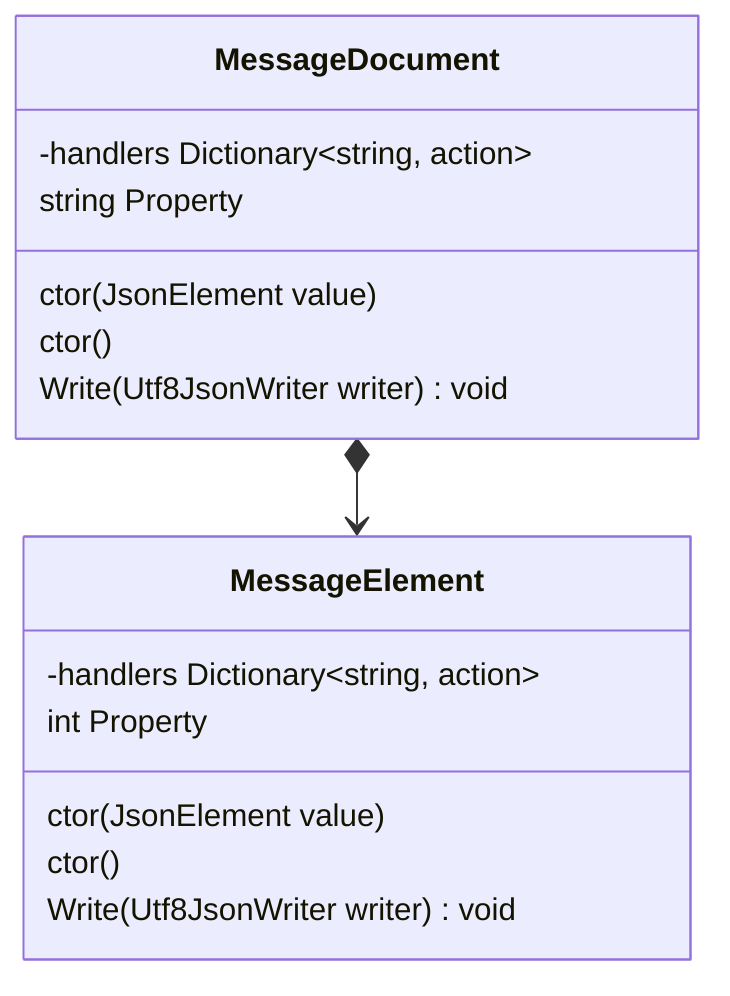

# DOM Factory Pattern

A pattern for serializing and deserializing structured documents that is resilient to the evolution of the document structure and the serialization syntax.

## Motivation

Inter-process and network communication is prevalent in almost every piece of software today. Software applications talk to each other using application protocols that communicate messages. Those messages must be serialized and deserialized into order to be passed between applications.

As software evolves the contents and shape of the message can change to meet new requirements or solve discovered problems. Changing messages has the potential to force changes in the all the software components that process those messages.  The DOMFactory pattern aims to minimize the impact of those changes by centralizing the logic that understands the nature of those changes in order to eliminate the need for other components to contain that logic.

It is the responsibility of the owner of the message to encapsulate the changes made in different versions of the message so that consumers of the message only ever have to work with one version of the message.

This enables consuming applications to transparently handle all previous versions.



This pattern also enables producer applications to generate previous versions (sometimes lossy) to drive consumer applications that do not yet support the latest version of the message.



## Problem Statement

Writing custom parsing and deserialization code for every message type requires a significant amount of code that is performance and security sensitive. To address this, most programming languages have developed generic libraries that can take a serialized message in a known format like JSON, XML or YAML and automatically translate it into a provided language type. This enables application developers to create language types that mirror the shape of the message and the automatic (de)serialization libraries are able to introspect the structure of the type and infer the mapping of the message to the type. Where there is missing metadata, annotations can be applied to the language type to guide the mapping. These automatic deserialization libraries usually have a set of global settings that allow expressing preferences that impact how values are maps because not every developer uses the same set of conventions when it comes to serialization. Examples of this for JSON, include character casing of object member names, format of dates, currencies and null object handling.

With the convenience of automatic (de)serializers, the responsibility of message deserialization is usually left to the application developer who is consuming or producing the message.  However, when messages evolve, it becomes the responsibility of every application developer who produces or consumes that message to change their application code. For any non-trivial change it is likely that the automatic (de)serializer library will need to have a mirror type for each version of the message. This requires an app developer to at least partially read the message to discover the version of the message so it can select the right language type to deserialize, unless the version is passed out of band, or the application only chooses to support a single version.

These challenges with handling multiple versions of a document lead producers and consumers to be slow to adopt new versions for fear of impacting existing partners, or when they do change they quickly drop support for the old versions due to application complexity. A worse outcome is when only partial features of a new version are supported so as to address immediate needs but without fully supporting that version. This leads to significant user confusion when validating messages.

## Solution Overview

The vast majority of application defined messages are based on standard generic formats such as JSON, XML and YAML. This pattern attempts to address the problems described by breaking (de)serialization down into two distinct parts:

- translating between the serialized wire format and a syntax DOM based on the underlying document format. e.g. JSON
- translating between the syntax DOM (e.g. JsonDocument) and the application DOM (e.g. BankTransferV1)

### Format Parsing

Using existing libraries for parsing the base format (e.g. JSON, XML or YAML) in the target language provides a secure and efficient way of converting the wire format into a base format DOM that can be processed. This standardization of formats like JSON, XML and YAML ensures a consistent interpretation of the wire format that is properly validated against the standard.


### Application Domain Parsing

Once the base format DOM has been produced, it is traversed and the corresponding domain specific objects are created and populated with values that have are extracted from the base format DOM.



The mapping code can be written by hand or generated, based on schemas, for complex documents. AI based assistants have proven very effective at suggesting the mapping code once they have seen a few examples and have example messages to work from.

## Structure of the Pattern

The pattern requires creating model classes and members that represent the content of the message. Each class requires the following elements:

- **consumer factory**: a constructor or static factory method that accepts an compatible node from the base format syntax.
- **producer factory**: a constructor or static factory method that enables creating the model independently of a message.
- **writer**: A method that will serialize the object into passed base format document writer.
- **handlers**: A member that holds a dictionary of actions where the wire format member name is the key.

Consider the following JSON message:

```json
    {
        "property": "value",
        "element": {
            "property": 10
        }
    }

```

The following model objects would be required to represent the contents of the message.



If the handlers dictionary is static, then the action must accept an instance of the target model object as well as source base format DOM object.

## Implementation Details

Once a wire format representation is deserialized into a base format DOM, such as a JsonDocument object, it is passed to the **consumer factory** method of the root model object to initiate the mapping of values from the base format DOM to the model objects.  

### Consumer Factory Responsibilities

The consumer factory must create an instance of the target model object and then iterate through the members of the current base format DOM node, processing each member.

If that node corresponds to a JsonObject then a helper method such as this can be used to execute the handler for each member in the JsonObject against the model instance.

```csharp
    public static void ParseMap<T>(JsonElement node, T document, Dictionary<string, Action<T, JsonElement>> handlers)
        {
            foreach (var element in node.EnumerateObject())
            {
                handlers[element.Name](document, element.Value);
            };
        }
```

This method execute handlers for known members and will fail if a member exists in the wire format that is not recognized. Support for fields that match patterns can be added by [testing the handler collection](https://github.com/microsoft/OpenAPI.NET/blob/c7aa71a3e86b6bc3e957a5488024e1397a34a050/src/Microsoft.OpenApi.Readers/ParseNodes/PropertyNode.cs#L32) first.  A secondary set of handlers can be provided for [pattern matching](https://github.com/microsoft/OpenAPI.NET/blob/c7aa71a3e86b6bc3e957a5488024e1397a34a050/src/Microsoft.OpenApi.Readers/V3/OpenApiDocumentDeserializer.cs#L41). 

### Handlers

Each handler in the dictionary of handlers provide an action (aka lambda) that will transfer information from a base format DOM node to a property of the object model. The key for the handler is the identifier used in the base format DOM. The action accepts the base format DOM node and in some cases the model object instance created by the consumer factory.  

### Writer

Every model object requires a writer method that will accept a base format writer. The method writes the contents of the model object into the passed writer.

## Examples

Example of a root model object in C# that uses constructors for the **producer factory** and **consumer factory**.  The following examples use some [helper methods](https://github.com/microsoftgraph/kibali/blob/main/src/kibali/ParsingHelpers.cs) to avoid repetitive code in the handler actions and factory methods.

```csharp
public class ApiManifestDocument
{
    public Publisher? Publisher { get; set; }
    public string? ApplicationName { get; set; }
    public ApiDependencies ApiDependencies { get; set; } = new ApiDependencies();
    public Extensions Extensions { get; set; } = new Extensions();

    private const string PublisherProperty = "publisher";
    private const string ApplicationNameProperty = "applicationName";
    private const string ApiDependenciesProperty = "apiDependencies";
    private const string ExtensionsProperty = "extensions";

    public ApiManifestDocument(string applicationName)
    {
        ApplicationName = applicationName;
        Validate();
    }

    public ApiManifestDocument(JsonElement value)
    {
        ParsingHelpers.ParseMap(value, this, handlers);
        Validate();
    }

    // Write method
    public void Write(Utf8JsonWriter writer)
    {
        ValidationHelpers.ThrowIfNull(writer, nameof(writer));
        Validate();
        writer.WriteStartObject();
        writer.WriteString(ApplicationNameProperty, ApplicationName);
        if (Publisher != null)
        {
            writer.WritePropertyName(PublisherProperty);
            Publisher.Write(writer);
        }
        if (ApiDependencies.Any())
        {
            writer.WritePropertyName(ApiDependenciesProperty);
            writer.WriteStartObject();
            foreach (var apiDependency in ApiDependencies)
            {
                writer.WritePropertyName(apiDependency.Key);
                apiDependency.Value.Write(writer);
            }
            writer.WriteEndObject();
        }
        if (Extensions.Any())
        {
            writer.WritePropertyName(ExtensionsProperty);
            Extensions.Write(writer);
        }
        writer.WriteEndObject();
    }

    // Load method
    public static ApiManifestDocument Load(JsonElement value)
    {
        return new ApiManifestDocument(value);
    }

    internal void Validate()
    {
        ValidationHelpers.ValidateNullOrWhitespace(nameof(ApplicationName), ApplicationName, nameof(ApiManifestDocument));
        Publisher?.Validate();
    }

    // Create fixed field map for ApiManifest
    private static readonly FixedFieldMap<ApiManifestDocument> handlers = new()
    {
        { ApplicationNameProperty, (o,v) => {o.ApplicationName = v.GetString(); } },
        { PublisherProperty, (o,v) => {o.Publisher = Publisher.Load(v);  } },
        { ApiDependenciesProperty, (o,v) => {o.ApiDependencies = new ApiDependencies(ParsingHelpers.GetMap(v, ApiDependency.Load));  } },
        { ExtensionsProperty, (o,v) => {o.Extensions = Extensions.Load(v);  } }
    };
}
```
https://github.com/microsoft/openapi.apimanifest

Example of a child model object in C# that uses a static factory method instead of constructor as a **consumer factory**.

```csharp
    public class Permission
    {
        public string Note { get; set; }
        public bool Implicit { get; set; } = false;
        public string PrivilegeLevel { get; set; }
        public SortedDictionary<string, Scheme> Schemes { get; set; } = new SortedDictionary<string, Scheme>();
        public List<PathSet> PathSets { get; set; } = new List<PathSet>();
        public OwnerInfo OwnerInfo { get; set; } = new();

        public void Write(Utf8JsonWriter writer)
        {
            writer.WriteStartObject();

            if (!string.IsNullOrWhiteSpace(Note)) writer.WriteString("note", Note);
            if (Implicit) writer.WriteBoolean("implicit", Implicit);

            writer.WritePropertyName("schemes");
            writer.WriteStartObject();
            foreach (var scheme in Schemes)
            {
                writer.WritePropertyName(scheme.Key.ToString());
                scheme.Value.Write(writer);
            }
            writer.WriteEndObject();

            writer.WritePropertyName("pathSets");
            writer.WriteStartArray();
            foreach (var pathSet in PathSets)
            {
                pathSet.Write(writer);
            }
            writer.WriteEndArray();

            writer.WritePropertyName("ownerInfo");
            OwnerInfo.Write(writer);

            writer.WriteEndObject();
        }

        internal static Permission Load(JsonElement value)
        {
            var permission = new Permission();
            ParsingHelpers.ParseMap(value, permission, handlers);
            return permission;
        }

        private static FixedFieldMap<Permission> handlers = new()
        {
            { "note", (o,v) => {o.Note = v.GetString();  } },
            { "privilegeLevel", (o,v) => {o.PrivilegeLevel= v.GetString();  } },
            { "implicit", (o,v) => {o.Implicit = v.GetBoolean();  } },
            { "pathSets", (o,v) => {o.PathSets = ParsingHelpers.GetList(v, PathSet.Load);  } },
            { "schemes", (o,v) => {o.Schemes = ParsingHelpers.GetOrderedMap(v, Scheme.Load);  } },
            { "ownerInfo", (o,v) => {o.OwnerInfo = OwnerInfo.Load(v);  } },
        };
    }

```
https://github.com/microsoftgraph/kibali/blob/main/src/kibali/Permission.cs

For object models that have a complex inheritance hierarchy there may be benefits to creating the dictionary of handlers from an object instance rather than having it as a static dictionary.

```csharp
        public override IDictionary<string, Action<IParseNode>> GetFieldDeserializers() {
            return new Dictionary<string, Action<IParseNode>>(base.GetFieldDeserializers()) {
                {"attachmentSessions", n => { AttachmentSessions = n.GetCollectionOfObjectValues<AttachmentSession>(AttachmentSession.CreateFromDiscriminatorValue)?.ToList(); } },
                {"attachments", n => { Attachments = n.GetCollectionOfObjectValues<AttachmentBase>(AttachmentBase.CreateFromDiscriminatorValue)?.ToList(); } },
                {"body", n => { Body = n.GetObjectValue<ItemBody>(ItemBody.CreateFromDiscriminatorValue); } },
                {"bodyLastModifiedDateTime", n => { BodyLastModifiedDateTime = n.GetDateTimeOffsetValue(); } },
                {"categories", n => { Categories = n.GetCollectionOfPrimitiveValues<string>()?.ToList(); } },
                {"checklistItems", n => { ChecklistItems = n.GetCollectionOfObjectValues<ChecklistItem>(ChecklistItem.CreateFromDiscriminatorValue)?.ToList(); } },
                {"completedDateTime", n => { CompletedDateTime = n.GetObjectValue<DateTimeTimeZone>(DateTimeTimeZone.CreateFromDiscriminatorValue); } },
                {"createdDateTime", n => { CreatedDateTime = n.GetDateTimeOffsetValue(); } },
                {"dueDateTime", n => { DueDateTime = n.GetObjectValue<DateTimeTimeZone>(DateTimeTimeZone.CreateFromDiscriminatorValue); } },
                {"extensions", n => { Extensions = n.GetCollectionOfObjectValues<Extension>(Extension.CreateFromDiscriminatorValue)?.ToList(); } },
                {"hasAttachments", n => { HasAttachments = n.GetBoolValue(); } },
                {"importance", n => { Importance = n.GetEnumValue<Importance>(); } },
                {"isReminderOn", n => { IsReminderOn = n.GetBoolValue(); } },
                {"lastModifiedDateTime", n => { LastModifiedDateTime = n.GetDateTimeOffsetValue(); } },
                {"linkedResources", n => { LinkedResources = n.GetCollectionOfObjectValues<LinkedResource>(LinkedResource.CreateFromDiscriminatorValue)?.ToList(); } },
                {"recurrence", n => { Recurrence = n.GetObjectValue<PatternedRecurrence>(PatternedRecurrence.CreateFromDiscriminatorValue); } },
                {"reminderDateTime", n => { ReminderDateTime = n.GetObjectValue<DateTimeTimeZone>(DateTimeTimeZone.CreateFromDiscriminatorValue); } },
                {"startDateTime", n => { StartDateTime = n.GetObjectValue<DateTimeTimeZone>(DateTimeTimeZone.CreateFromDiscriminatorValue); } },
                {"status", n => { Status = n.GetEnumValue<TaskStatus>(); } },
                {"title", n => { Title = n.GetStringValue(); } },
            };
        }

```
https://github.com/microsoftgraph/msgraph-sdk-dotnet/blob/dev/src/Microsoft.Graph/Generated/Models/TodoTask.cs and the equivalent in Java https://github.com/microsoftgraph/msgraph-sdk-java/blob/f2960ba4d02bb15a01a9b2750d43c5e978eb21b4/src/main/java/com/microsoft/graph/generated/models/TodoTask.java#L113

In this particular example, the models are generated from a schema.  The actions in the handler dictionary only accept a single parameter because the target model instance is closed over by the lambda.