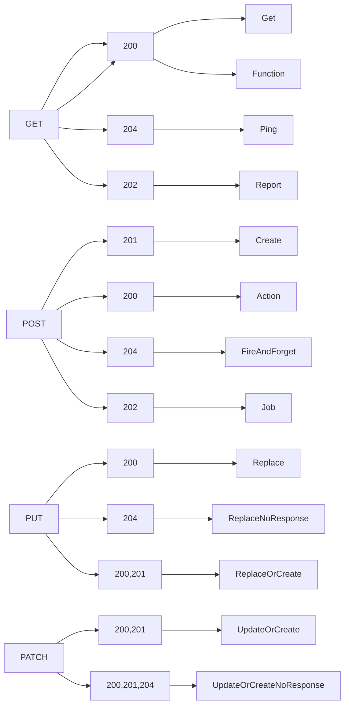

# HTTP Methods

API consumers interact with resources in an API using [HTTP Methods](https://www.iana.org/assignments/http-methods/http-methods.xhtml). There is a limited set of supported HTTP methods that can be reused across many resources.  Not every resource supports every method. 

